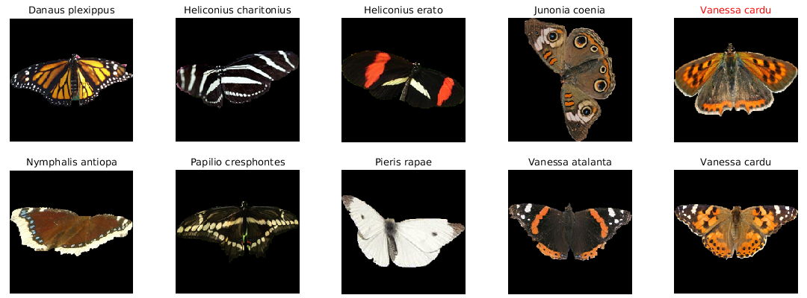
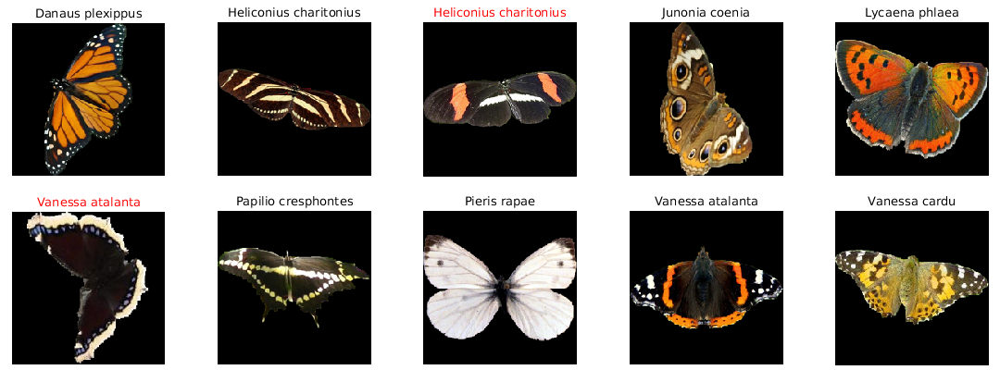

## Butterfly Category Classification

Initial work has been done on butterfly-category classification based on color features.

**Language/Tool:** MATLAB 2016a

**Categories are:**
- Danaus plexippus
- Heliconius charitonius
- Heliconius erato
- Junonia coenia
- Lycaena phlaea
- Nymphalis antiopa
- Papilio cresphontes
- Pieris rapae
- Vanessa atalanta
- Vanessa cardu

**The dataset is available at:** [Leeds Butterfly Dataset](http://www.comp.leeds.ac.uk/scs6jwks/dataset/leedsbutterfly/)

| Results: ( Misclassified samples are labeled in red )             |
|:-----------------------------------------------------------------:|
|    Fig. 1                      |
|    Fig. 2                      |
